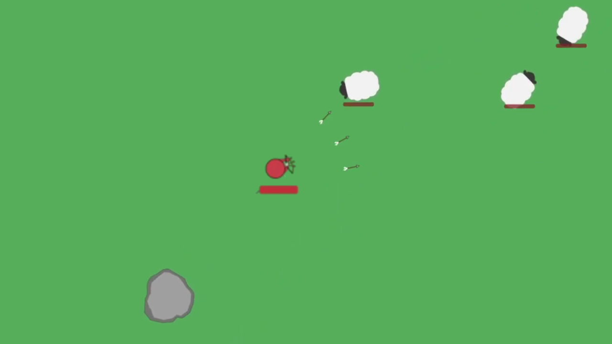

# Barbarians3
Put this project onto Github to archive old projects. Made in 2018.

## Overview

Same as [Barbarians1](https://github.com/EvanGyori/Barbarians1) and [Barbarians2](https://github.com/EvanGyori/Barbarians2) except now with lag, bears and sheep together, a menu screen, and special abilities.



## Usage

Run `Index.html` in any web browser

To unlock abilities, type the following into the console:
```
players['p1'].lvl = 999
```

WASD to move

LMB to attack/gather.

press Q to use ability 1

Press E to use ability 2

Press 1 to use ability 3

Press 2 to use ability 4
